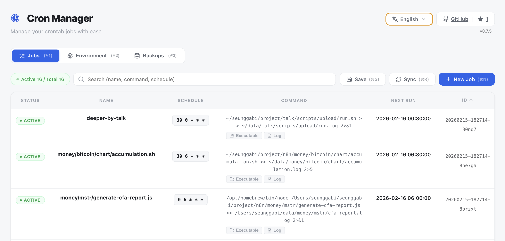
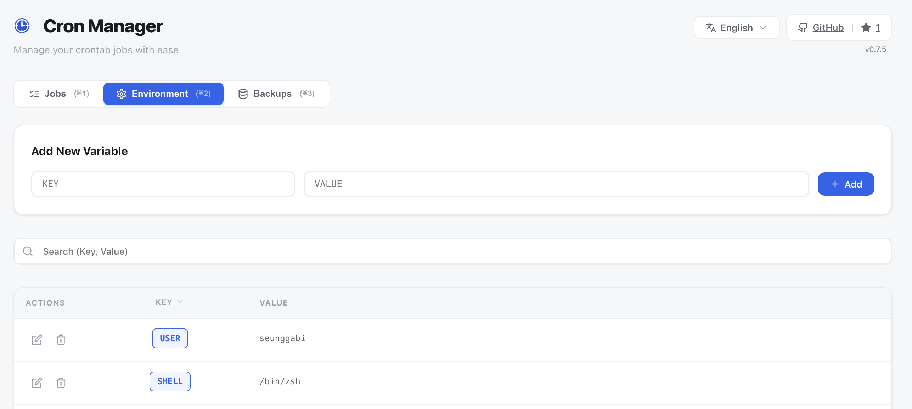
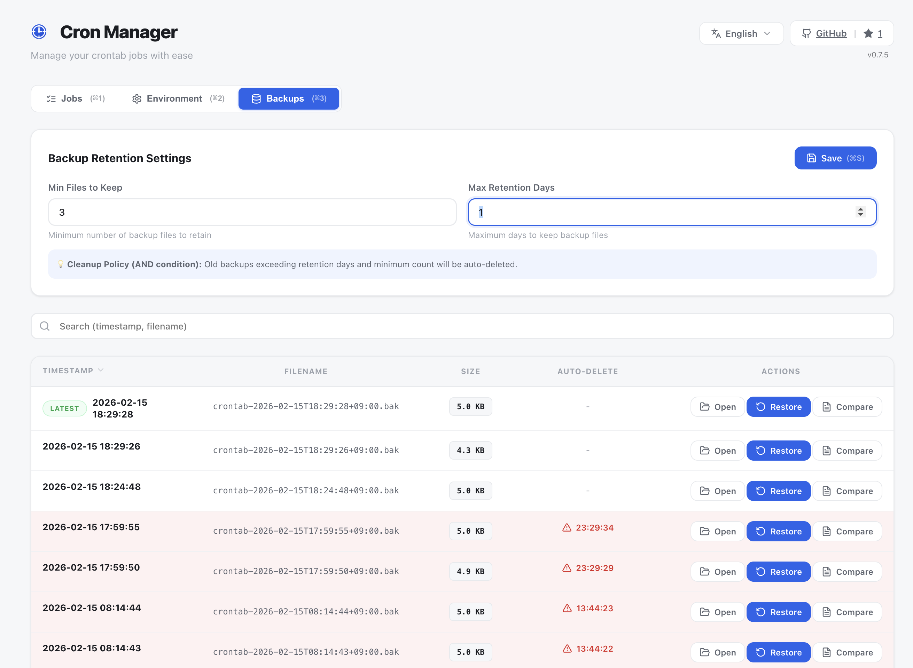
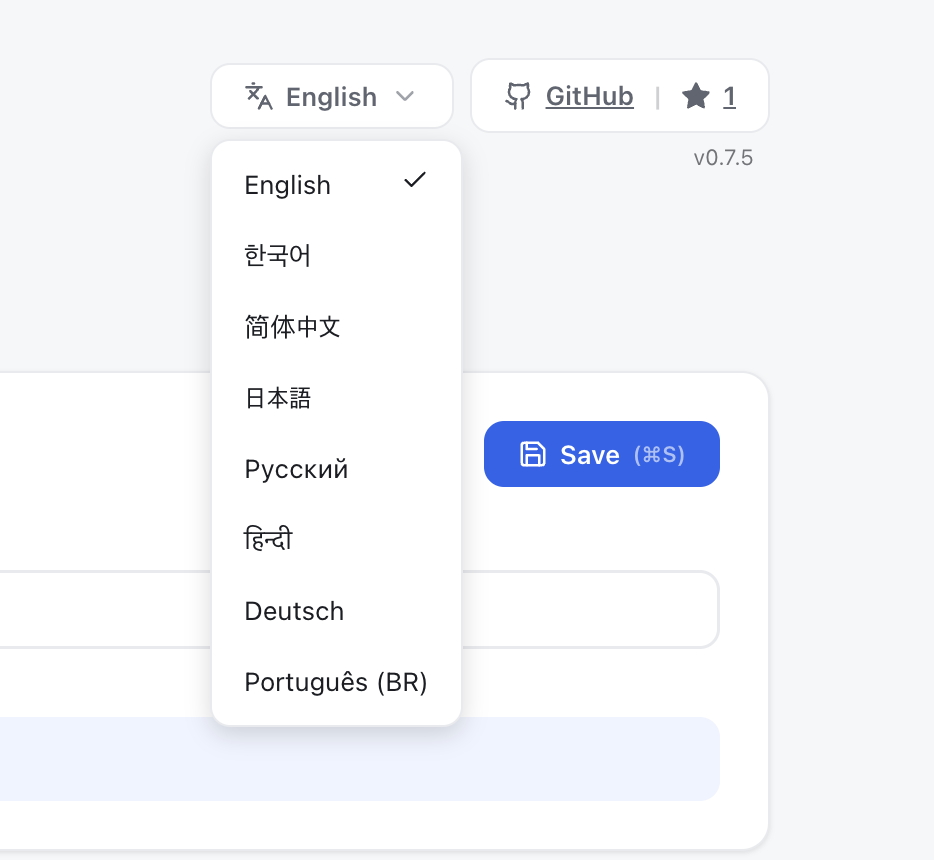

# Cron Manager - Electron Desktop App

[](https://github.com/seunggabi/cron-manager/actions/workflows/build-release.yml)
[](https://github.com/seunggabi/cron-manager/releases/latest)
[](https://opensource.org/licenses/MIT)
[](https://github.com/seunggabi/cron-manager/stargazers)
[](https://nodejs.org)
[](https://www.typescriptlang.org)
[](https://www.electronjs.org)

A modern, feature-rich GUI-based crontab manager built with Electron, React, and TypeScript. Manage your cron jobs with ease through an intuitive interface with real-time synchronization, backup management, and advanced features.

## 📥 Download

Download the latest version for your platform:

- 🍎 **macOS**: [Download DMG](https://github.com/seunggabi/cron-manager/releases/latest)
- 🪟 **Windows**: [Download Installer](https://github.com/seunggabi/cron-manager/releases/latest)
- 🐧 **Linux**: [Download AppImage](https://github.com/seunggabi/cron-manager/releases/latest) or [Download DEB](https://github.com/seunggabi/cron-manager/releases/latest)

All releases are automatically built and published via GitHub Actions.

## 📦 Installation

### macOS

1. Download the `.dmg` file from the [latest release](https://github.com/seunggabi/cron-manager/releases/latest)
2. Open the DMG file and drag "Cron Manager" to the Applications folder
3. **Important**: macOS may block the app with a "damaged" error because it's not signed with an Apple Developer certificate

**To bypass Gatekeeper (choose one method):**

**Method 1: Right-click to open (Recommended)**
1. Open Finder and go to Applications
2. **Right-click** (or Control+click) on "Cron Manager"
3. Select "Open" from the menu
4. Click "Open" in the security dialog
5. The app will launch and won't be blocked again

**Method 2: Remove quarantine attribute (Terminal)**

🚨🚨🚨🚨🚨🚨🚨🚨🚨🚨🚨🚨🚨🚨🚨🚨🚨🚨🚨🚨🚨🚨🚨🚨🚨🚨🚨🚨🚨🚨🚨🚨🚨🚨🚨🚨🚨🚨🚨🚨🚨🚨🚨🚨🚨🚨🚨🚨
```bash
sudo xattr -rd com.apple.quarantine "/Applications/Cron Manager.app"
```
🚨🚨🚨🚨🚨🚨🚨🚨🚨🚨🚨🚨🚨🚨🚨🚨🚨🚨🚨🚨🚨🚨🚨🚨🚨🚨🚨🚨🚨🚨🚨🚨🚨🚨🚨🚨🚨🚨🚨🚨🚨🚨🚨🚨🚨🚨🚨🚨

Enter your password when prompted, then launch the app normally.

**Method 3: System Settings**
1. Try to open the app normally (it will be blocked)
2. Open System Settings → Privacy & Security
3. Scroll down to find "Cron Manager was blocked"
4. Click "Open Anyway"
5. Try opening the app again and click "Open"

### Windows

1. Download the `.exe` installer from the [latest release](https://github.com/seunggabi/cron-manager/releases/latest)
2. Run the installer
3. Windows SmartScreen may show a warning - click "More info" and then "Run anyway"
4. Follow the installation wizard

### Linux

**AppImage (Universal)**
1. Download the `.AppImage` file
2. Make it executable: `chmod +x Cron.Manager-*.AppImage`
3. Run it: `./Cron.Manager-*.AppImage`

**Debian/Ubuntu (.deb)**
1. Download the `.deb` file
2. Install: `sudo dpkg -i cron-manager_*_amd64.deb`
3. Run: `cron-manager` or find it in your applications menu

## 📸 Screenshots

### Main Interface - Job Management

*Manage cron jobs with intuitive UI - ID column, sorting, inline editing*

### Quick Edit Mode

*Double-click to edit job names and schedules inline*

### Environment Variables

*Configure global and per-job environment variables*

### Backup Management

*Automatic backups with diff viewer and restore functionality*

### Multi-Language Support

*8 languages supported: English, Korean, Japanese, Chinese, German, Russian, Hindi, Portuguese*

## ✨ Features

### 📝 Job Management
- **Visual cron job management** - Create, edit, and delete cron jobs through an intuitive UI
- **Real-time crontab synchronization** - Automatically sync with system crontab
- **Job ID column** - Unique identifier for each job with sorting support
- **Job reordering** - Drag and drop to reorganize jobs
- **Enable/disable jobs** - Toggle jobs without deleting them
- **Instant execution** - Run jobs immediately for testing
- **Test mode** - 1-minute test execution with auto-cleanup
- **Next run preview** - See when jobs will execute next

### ⏰ Schedule Management
- **Schedule validation** - Real-time cron expression validation
- **Visual schedule builder** - Predefined schedule presets
- **Next runs preview** - See upcoming execution times (up to 5)
- **Human-readable format** - Understand schedules at a glance
- **Cron expression presets** - Common schedules (hourly, daily, weekly, monthly, etc.)

### 🌍 Environment Variables
- **Global environment variables** - Set variables for all jobs
- **Per-job environment variables** - Job-specific environment configuration
- **Variable validation** - Ensure valid environment variable names
- **Search and filter** - Find variables quickly
- **Sort and organize** - Sort by key or value

### 💾 Backup & Restore
- **Automatic backups** - Crontab backed up on every change
- **Manual backup creation** - Create backups on demand
- **Backup retention** - Configurable retention policy (max files and days)
- **Restore functionality** - Restore from any backup point
- **Diff viewer** - Compare current crontab with backups
- **Search backups** - Find specific backups quickly
- **Countdown timer** - See when backups will be auto-deleted

### 📁 Advanced Features
- **Working directory configuration** - Set execution context per job
- **Log file management** - Configure and view log files
- **Real-time log viewer** - Open logs in Terminal with `tail -f`
- **Log directory creation** - Automatically create log directories
- **Script folder access** - Quick access to script locations
- **Job tagging** - Organize jobs with tags
- **Job descriptions** - Add notes and documentation
- **Resizable columns** - Customize table column widths

### ⌨️ Keyboard Shortcuts
- **Cmd/Ctrl+N** - Create new job
- **Cmd/Ctrl+R** - Sync with crontab
- **Cmd/Ctrl+F** - Search/filter
- **Cmd/Ctrl+1** - Switch to Jobs tab
- **Cmd/Ctrl+2** - Switch to Environment Variables tab
- **Cmd/Ctrl+3** - Switch to Backup Management tab

### 🎨 UI/UX
- **Modern interface** - Clean, intuitive design with Radix UI
- **Dark mode support** - Comfortable viewing in any lighting
- **Responsive tables** - Resizable and sortable columns
- **Search and filter** - Find jobs, variables, and backups quickly
- **Multi-language support** - 8 languages: English, Korean, Japanese, Chinese (Simplified), German, Russian, Hindi, Portuguese (Brazil)
- **GitHub integration** - View repository stars in-app
- **Application menu** - Full macOS/Windows menu support

## 🏗️ Architecture

### Electron Structure

```
cron-manager/
├── src/
│   ├── main/              # Main Process (Node.js)
│   │   ├── index.ts       # Electron main entry
│   │   ├── menu.ts        # Application menu & shortcuts
│   │   ├── ipc/           # IPC handlers
│   │   │   └── index.ts
│   │   └── services/      # Business logic
│   │       ├── crontab.service.ts
│   │       ├── schedule.service.ts
│   │       └── config.service.ts
│   ├── preload/           # Preload scripts (Context Bridge)
│   │   ├── index.ts
│   │   └── types.d.ts
│   └── preload/           # Context Bridge
│       ├── index.ts
│       └── types.d.ts
├── frontend/              # React UI (Vite)
│   └── src/
│       ├── App.tsx
│       ├── components/    # React components
│       │   ├── JobForm.tsx
│       │   ├── GlobalEnvSettings.tsx
│       │   ├── BackupManager.tsx
│       │   ├── ConfirmDialog.tsx
│       │   └── ...
│       ├── hooks/         # Custom hooks
│       ├── lib/           # IPC communication
│       ├── utils/         # Utilities
│       └── __tests__/     # Tests (Vitest)
├── backend/               # Optional API server
│   └── src/
│       ├── routes/
│       ├── services/
│       └── __tests__/
├── shared/                # Workspace package
│   ├── types/
│   └── utils/
├── dist/                  # Built frontend
├── dist-electron/         # Built main & preload
└── release/               # Packaged apps
```

### IPC Channels

#### Jobs
- `jobs:getAll` - Get all cron jobs with next run times
- `jobs:create` - Create a new job with validation
- `jobs:update` - Update existing job
- `jobs:delete` - Delete a job
- `jobs:toggle` - Enable/disable a job
- `jobs:run` - Run job immediately (test mode)
- `jobs:sync` - Sync with current crontab
- `jobs:testIn1Minute` - Create test job that auto-deletes after 2 minutes
- `jobs:reorder` - Reorder jobs by ID array

#### Schedule
- `schedule:parse` - Validate and parse cron expression
- `schedule:getPresets` - Get predefined schedule presets

#### Logs
- `logs:open` - Open log file in Terminal with tail -f
- `logs:checkDir` - Check if log directory exists
- `logs:createDir` - Create log directory
- `logs:create` - Create empty log file

#### Files
- `files:open` - Open executable file directory in Finder/Explorer

#### Backups
- `backups:list` - List all available backups
- `backups:restore` - Restore crontab from backup
- `backups:diff` - Get diff between current crontab and backup

#### Environment Variables
- `env:getGlobal` - Get all global environment variables
- `env:setGlobal` - Set global environment variables
- `env:updateGlobalVar` - Update or create a global variable
- `env:deleteGlobalVar` - Delete a global variable

#### Configuration
- `config:getBackupConfig` - Get backup retention settings
- `config:updateBackupConfig` - Update backup retention (max files, max days)

## 🚀 Development

### Prerequisites

- Node.js >= 18.0.0
- npm or yarn
- macOS, Windows, or Linux

### Installation

```bash
npm install
```

### Development Mode

Run the app in development mode with hot-reload:

```bash
npm run dev
```

This will:
1. Start Vite dev server (port 5173)
2. Compile TypeScript (main process)
3. Launch Electron with DevTools

### Restart During Development

Quick restart during development:

```bash
npm run restart
```

### Build for Production

Build the renderer and main process:

```bash
npm run build:dev
```

### Package Application

Package for current platform (no installer):

```bash
npm run package
```

Build distributables with installers:

```bash
# macOS (.dmg, .zip)
npm run electron:build:mac

# Windows (NSIS installer, .zip)
npm run electron:build:win

# Linux (AppImage, .deb)
npm run electron:build:linux

# All platforms
npm run electron:build
```

Built packages are output to `release/{version}/`

## 📦 Project Migration

This project was migrated from a client-server architecture to Electron:

### Before (Client-Server)
- **Frontend**: React app (Vite) - HTTP client
- **Backend**: Express server - REST API
- **Communication**: Axios HTTP requests
- **Deployment**: Separate frontend/backend processes

### After (Electron)
- **Main Process**: Backend logic via IPC
- **Renderer Process**: React UI
- **Communication**: IPC (Inter-Process Communication)
- **Deployment**: Single packaged application

### Key Changes

1. **Removed**: Express, Axios, CORS, HTTP server
2. **Added**: Electron, IPC handlers, Context Bridge, Application Menu
3. **Modified**: API client (`frontend/src/lib/api.ts`) - now uses `window.electronAPI`
4. **Reused**: All business logic from `backend/src/services/`
5. **Reused**: All React components from `frontend/src/`
6. **Added**: Backup management, global environment variables, keyboard shortcuts

## 📋 Scripts

| Command | Description |
|---------|-------------|
| `npm run dev` | Start development mode with hot-reload |
| `npm run restart` | Quick restart during development |
| `npm run build` | Build and package application with installer |
| `npm run build:dev` | Build without packaging (dist only) |
| `npm run package` | Package app (no installer) |
| `npm run electron:build` | Build installers for all platforms |
| `npm run electron:build:mac` | Build macOS DMG and zip |
| `npm run electron:build:win` | Build Windows NSIS installer and zip |
| `npm run electron:build:linux` | Build Linux AppImage and deb |
| `npm run lint` | Run ESLint |
| `npm run type-check` | TypeScript type checking |
| `npm test` | Run all tests (Backend & Frontend) |
| `npm run test:coverage` | Generate coverage report |

## ⚙️ Configuration

### electron-builder.json

Application build settings are in `package.json` under the `"build"` key:

```json
{
  "appId": "com.seunggabi.cron-manager",
  "productName": "Cron Manager",
  "directories": {
    "output": "release/${version}"
  },
  "files": ["dist", "dist-electron"],
  "mac": {
    "target": ["dmg", "zip"],
    "category": "public.app-category.developer-tools",
    "icon": "build/icon.icns"
  },
  "win": {
    "target": ["nsis", "zip"],
    "icon": "build/icon.ico"
  },
  "linux": {
    "target": ["AppImage", "deb"],
    "category": "Development",
    "icon": "build/icon.png"
  }
}
```

Customize:
- App ID, name, version
- Icon paths (`build/icon.{icns,ico,png}`)
- Target platforms and formats
- Installer options

### vite.config.ts

Vite build configuration:
- Electron plugin settings
- Renderer build output
- Dev server port (5173)
- Path aliases
- TypeScript integration

### Backup Configuration

Backup retention is configurable via the Backup Management tab:
- **Max Backup Files**: Maximum number of backup files to keep (default: 10)
- **Max Backup Days**: Maximum age of backup files in days (default: 7)

Backups are stored in `~/.cron-manager/backups/`

## 🔒 Security

This app follows Electron security best practices with comprehensive security enhancements:

### Security Features
- ✅ **Context Isolation** enabled
- ✅ **Node Integration** disabled
- ✅ **Preload script** with contextBridge
- ✅ **Sandbox mode** enabled
- ✅ **Command injection prevention** - Sanitized execution
- ✅ **Path traversal protection** - Validated file paths
- ✅ **Secure temp files** - Random names, 0600 permissions
- ✅ **Input validation** for all IPC handlers
- ✅ **Environment variable** validation
- ✅ **Type safety** - 100% TypeScript coverage

### Security Audit (v0.4.0)
- 🔒 **8 Critical/High vulnerabilities** → **0 resolved**
- 🔒 All dependency vulnerabilities addressed
- 🔒 Comprehensive code review completed
- 🔒 Security test coverage added

## 🧪 Testing

### Automated Tests

Comprehensive test suite with 238 tests and ~80% code coverage:

```bash
# Run all tests
npm test

# Run with coverage report
npm run test:coverage

# Run in watch mode
npm run test:watch
```

**Test Statistics:**
- **Backend**: 81 tests (Services, Routes, Cron parsing)
- **Frontend**: 157 tests (Components, Hooks, Utilities)
- **Coverage**: ~80% code coverage
- **Frameworks**: Vitest, React Testing Library, Supertest

### Test Job Feature

The app includes a "Test in 1 Minute" feature for quick job testing:

```typescript
await window.electronAPI.jobs.testIn1Minute('echo "Hello World"', {
  env: { TEST_VAR: 'value' },
  workingDir: '/tmp'
});
```

This will:
1. Create a cron job scheduled 1 minute from now
2. Execute the command at the scheduled time
3. Auto-delete the job after 2 minutes

Perfect for testing commands before scheduling them permanently.

### Manual Testing

1. Create a test job with a simple command
2. Use "Run Now" to test execution immediately
3. Check logs in Terminal using the log viewer
4. Verify next run times are calculated correctly
5. Test backup and restore functionality

## 🐛 Troubleshooting

### App won't start

```bash
# Clean build and reinstall
rm -rf dist dist-electron node_modules
npm install
npm run dev
```

### macOS "damaged app" error

If macOS shows "App is damaged and can't be opened" error, this is due to Gatekeeper security:

**Option 1: Right-click to open (Recommended)**
1. Right-click (or Control+click) on the app
2. Select "Open" from the menu
3. Click "Open" in the dialog

**Option 2: Remove quarantine attribute**
```bash
# For DMG-installed app
xattr -cr /Applications/Cron\ Manager.app

# For extracted app
xattr -cr ~/Downloads/Cron\ Manager.app
```

**Option 3: System Settings**
1. System Settings → Privacy & Security
2. Scroll down to find "Cron Manager was blocked"
3. Click "Open Anyway"

### IPC communication errors

Check that:
1. Preload script is loaded correctly (`dist-electron/preload/index.js`)
2. `contextBridge.exposeInMainWorld` is called
3. `window.electronAPI` is available in renderer
4. Main process IPC handlers are registered

Debug in DevTools:
```javascript
// In renderer console
console.log(window.electronAPI);
```

### TypeScript errors

```bash
# Run type checker
npm run type-check

# Check specific file
npx tsc --noEmit path/to/file.ts
```

### Build errors

```bash
# Clean TypeScript cache
rm -rf dist-electron

# Rebuild main process
npm run build:dev
```

### Crontab not syncing

- Check crontab permissions: `crontab -l`
- Verify cron service is running
- Check application logs in DevTools Console
- Try manual sync with Cmd/Ctrl+R

## 📚 Resources

- [Electron Documentation](https://www.electronjs.org/docs)
- [Cron Expression Reference](https://crontab.guru/)
- [Radix UI Components](https://www.radix-ui.com/)
- [Vite Documentation](https://vitejs.dev/)

## 🤝 Contributing

Contributions are welcome! Please feel free to submit a Pull Request.

1. Fork the repository
2. Create your feature branch (`git checkout -b feature/AmazingFeature`)
3. Commit your changes (`git commit -m 'feat: Add some AmazingFeature'`)
4. Push to the branch (`git push origin feature/AmazingFeature`)
5. Open a Pull Request

## Star History

[](https://star-history.com/#seunggabi/cron-manager&Date)

## 📄 License

MIT License - see LICENSE file for details

## 👤 Author

**seunggabi**

- GitHub: [@seunggabi](https://github.com/seunggabi)
- Repository: [cron-manager](https://github.com/seunggabi/cron-manager)

---

Made with ❤️ using Electron, React, and TypeScript
